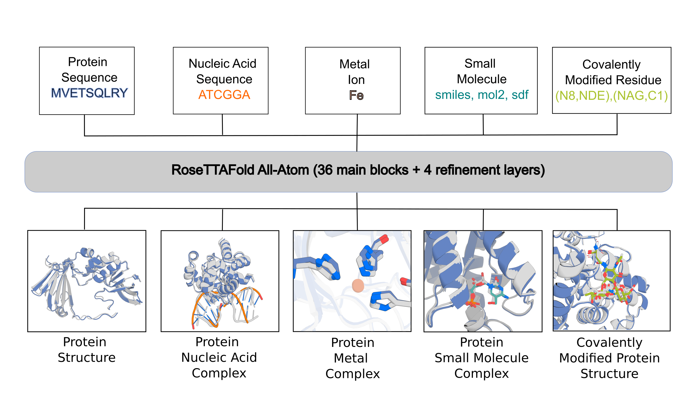

Code for RoseTTAFold All-Atom
--------------------
<p align="right">
  
</p>
RoseTTAFold All-Atom is a biomolecular structure prediction neural network that can predict a broad range of biomolecular assemblies including proteins, nucleic acids, small molecules, covalent modifications and metals as outlined in the <a href='https://www.science.org/doi/10.1126/science.adl2528'>RFAA paper</a>. 

RFAA is not accurate for all cases, but produces useful error estimates to allow users to identify accurate predictions. Below are the instructions for setting up and using the model. 

## Table of Contents
- [Setup/Installation](#set-up)
- [Inference Configs Using Hydra](#inference-config)
- [Predicting protein structures](#protein-pred)
- [Predicting protein/nucleic acid complexes](#p-na-complex)
- [Predicting protein/small molecule complexes](#p-sm-complex)
- [Predicting higher order complexes](#higher-order)
- [Predicting covalently modified proteins](#covale)
- [Understanding model outputs](#outputs)
- [Conclusion](#conclusion)

<a id="set-up"></a>
### Setup/Installation
1. Install Mamba
```
wget "https://github.com/conda-forge/miniforge/releases/latest/download/Mambaforge-$(uname)-$(uname -m).sh"
bash Mambaforge-$(uname)-$(uname -m).sh  # accept all terms and install to the default location
rm Mambaforge-$(uname)-$(uname -m).sh  # (optionally) remove installer after using it
source ~/.bashrc  # alternatively, one can restart their shell session to achieve the same result
```
2. Clone the package
```
git clone https://github.com/baker-laboratory/RoseTTAFold-All-Atom
cd RoseTTAFold-All-Atom
```
3. Create Mamba environment
```
mamba env create -f environment.yaml
conda activate RFAA  # NOTE: one still needs to use `conda` to (de)activate environments

cd rf2aa/SE3Transformer/
pip3 install --no-cache-dir -r requirements.txt
python3 setup.py install
cd ../../
```
4. Configure signalp6 after downloading a licensed copy of it from https://services.healthtech.dtu.dk/services/SignalP-6.0/
```
# NOTE: (current) version 6.0h is used in this example, which was downloaded to the current working directory using `wget`
signalp6-register signalp-6.0h.fast.tar.gz

# NOTE: once registration is complete, one must rename the "distilled" model weights
mv $CONDA_PREFIX/lib/python3.10/site-packages/signalp/model_weights/distilled_model_signalp6.pt $CONDA_PREFIX/lib/python3.10/site-packages/signalp/model_weights/ensemble_model_signalp6.pt
```
5. Install input preparation dependencies
```
bash install_dependencies.sh
```
6. Download the model weights.
```
wget http://files.ipd.uw.edu/pub/RF-All-Atom/weights/RFAA_paper_weights.pt
```
7. Download sequence databases for MSA and template generation.
```
# uniref30 [46G]
wget http://wwwuser.gwdg.de/~compbiol/uniclust/2020_06/UniRef30_2020_06_hhsuite.tar.gz
mkdir -p UniRef30_2020_06
tar xfz UniRef30_2020_06_hhsuite.tar.gz -C ./UniRef30_2020_06

# BFD [272G]
wget https://bfd.mmseqs.com/bfd_metaclust_clu_complete_id30_c90_final_seq.sorted_opt.tar.gz
mkdir -p bfd
tar xfz bfd_metaclust_clu_complete_id30_c90_final_seq.sorted_opt.tar.gz -C ./bfd

# structure templates (including *_a3m.ffdata, *_a3m.ffindex)
wget https://files.ipd.uw.edu/pub/RoseTTAFold/pdb100_2021Mar03.tar.gz
tar xfz pdb100_2021Mar03.tar.gz
```

8. Download BLAST
```
wget https://ftp.ncbi.nlm.nih.gov/blast/executables/legacy.NOTSUPPORTED/2.2.26/blast-2.2.26-x64-linux.tar.gz
mkdir -p blast-2.2.26
tar -xf blast-2.2.26-x64-linux.tar.gz -C blast-2.2.26
cp -r blast-2.2.26/blast-2.2.26/ blast-2.2.26_bk
rm -r blast-2.2.26
mv blast-2.2.26_bk/ blast-2.2.26
```

9. Set Environment Variables/Configs
To enable the ability to run outside of the main directory the following variables must bet set for each database.
This can be done by setting them permanently in your .bashrc or temporarily by running the following commands from the directory with the databases. 

```
export DB_UR30=`pwd`/UniRef30_2020_06
export DB_BFD=`pwd`/bfd/
export BLASTMAT=`pwd`/blast-2.2.26/data/
```
You will also need to set the sequence and hh databases in the config file described below as well as set the path to the weights.

To do this edit rf2aa/config/inference/base.yml and set the following database_params as well as the checkpoint_path.

sequencedb: "$path_to_databases/pdb100_2021Mar03/pdb100_2021Mar03"

hhdb: "$path_to_databases/pdb100_2021Mar03/pdb100_2021Mar03"

checkpoint_path: $path_to_weights/RFAA_paper_weights.pt

<a id="docker"></a>
### Running In Docker
You can avoid creating a conda environment and installing the dependencies by instead utilizing a docker image. You will need to run on a machine with gpus available and nvidia drivers installed. 
First build the image by running the following command from the main directory
```
docker build . -t rosetta-fold-all-atom:latest
```
In order to keep the container size manageable databases must be mounted inside the image from your filesystem as they are not included in the base image.
You will also need to include all the relevant input files including the fasta files, ligand sdfs, and config file in the directory you will launch the job from.
The config file will needs to specify paths as they are viewed from inside the container.
The following command will mount the current directory as /workdir/ inside the container. 
Therefore, inputs should be specified using /workdir/$input.file
See the config file in examples/docker/docker.yaml for what this looks like. 
The command to run is as follows:
```
docker run --gpus all\
    -v `pwd`:/workdir/\
    -v $path_to_uniref30:/mnt/databases/rfaa/latest/UniRef30_2020_06b/\
    -v $path_to_bfd:/mnt/databases/rfaa/latest/bfd/\
    -v $path_to_pdb100_2021Mar03.:/pdb100_2021Mar03/\
    -v $path_to_RFAA_paper_weights.pt:/weights/RFAA_paper_weights.pt\
rosetta-fold-all-atom:latest\
python -m rf2aa.run_inference -cd /workdir/ --config-name $config_name
```

To test this on the included example change to the example/docker/ directory and run the command above using the paths to the respective databases where applicable and "docker" for $config_name

Note: Due to licensing issues signalp6 is not included in the docker container and will not be utilized when using it. 


<a id="inference-config"></a>
### Inference Configs Using Hydra

We use a library called Hydra to compose config files for predictions. The actual script that runs the model is in `rf2aa/run_inference.py` and default parameters that were used to train the model are in `rf2aa/config/inference/base.yaml`. We highly suggest using the default parameters since those are closest to the training task for RFAA but we have found that increasing loader_params.MAXCYCLE=10 (default set to 4) gives better results for hard cases (as noted in the paper). 

The general way to run the model is as follows:
```
python -m rf2aa.run_inference --config-name {your inference config}
```
The main inputs into the model are split into:
- protein inputs (protein_inputs)
- nucleic acid inputs (na_inputs)
- small molecule inputs (sm_inputs)
- covalent bonds between protein chains and small molecule chains
- modified or unnatural amino acids (COMING SOON)

In the following sections, we will describe how to set up configs for different prediction tasks that we described in the paper. 

<a id="protein-pred"></a>
### Predicting Protein Monomers

Predicting a protein monomer structure requires an input fasta file and an optional job_name which will be used to name your output files. Here is a sample config (also in `rf2aa/config/inference/protein.yaml`).
```
defaults:
  - base

job_name: "7u7w_protein"
protein_inputs: 
  A:
    fasta_file: examples/protein/7u7w_A.fasta
```
The first line indicates that this job inherits all the configurations from the base file (this should be true for all your inference jobs). Then you can optionally specify the job name (the default job_name is "structure_prediction" so we highly recommend specifying one).

When specifying the fasta file for your protein, you might notice that it is nested within a mysterious "A" parameter. This represents a chain letter and is absolutely **required**, this is important when users are specifying multiple chains. 

Now to predict the sample monomer structure, run:
```
python -m rf2aa.run_inference --config-name protein
```

<a id="p-na-complex"></a>
### Predicting Protein Nucleic Acid Complexes
Protein-nucleic acid complexes have very similar syntax to protein monomer prediction, except with additional chains for nucleic acids. Here is sample config (also in `rf2aa/config/inference/nucleic_acid.yaml`):
```
defaults:
  - base

job_name: "7u7w_protein_nucleic"
protein_inputs: 
  A: 
    fasta_file: examples/protein/7u7w_A.fasta
na_inputs: 
  B: 
    fasta: examples/nucleic_acid/7u7w_B.fasta
    input_type: "dna"
  C: 
    fasta: examples/nucleic_acid/7u7w_C.fasta
    input_type: "dna"
```
Once again this config inherits the base config, defines a job name and provides a protein fasta file for chain A. To add double stranded DNA, you must add two more chain inputs for each strand (shown here as chains B and C). In this case, the allowed input types are dna and rna. 

This repo currently does not support making RNA MSAs or pairing protein MSAs with RNA MSAs but this is functionality that we are keen to add. For now, please use RF-NA for modeling cases requiring paired protein-RNA MSAs. 

Now, predict the example protein/NA complex. 
```
python -m rf2aa.run_inference --config-name nucleic_acid
```
<a id="p-sm-complex"></a>
### Predicting Protein Small Molecule Complexes
To predict protein small molecule complexes, the syntax to input the protein remains the same. Adding in the small molecule works similarly to other inputs. 
Here is an example (from `rf2aa/config/inference/protein_sm.yaml`):
```
defaults:
  - base
job_name: "3fap"

protein_inputs:
  A:
    fasta_file: examples/protein/3fap_A.fasta
  B: 
    fasta_file: examples/protein/3fap_B.fasta

sm_inputs:
  C:
    input: examples/small_molecule/ARD_ideal.sdf
    input_type: "sdf"
```
Small molecule inputs are provided as sdf files or smiles strings and users are **required** to provide both an input and an input_type field for every small molecule that they want to provide. Metal ions can also be provided as sdf files or smiles strings. 

To predict the example:
```
python -m rf2aa.run_inference --config-name protein_sm
```
<a id="higher-order"></a>
### Predicting Higher Order Complexes
If you have been following thus-far, this is where we put all the previous sections together! To predict a protein-nucleic acid-small molecule complex, you can combine the schema for all the inputs we have seen so far!

Here is an example:
```
defaults:
  - base

job_name: "7u7w_protein_nucleic_sm"
protein_inputs: 
  A: 
    fasta_file: examples/protein/7u7w_A.fasta
na_inputs: 
  B: 
    fasta: examples/nucleic_acid/7u7w_B.fasta
    input_type: "dna"
  C: 
    fasta: examples/nucleic_acid/7u7w_C.fasta
    input_type: "dna"
sm_inputs: 
  D:
    input: examples/small_molecule/XG4.sdf
    input_type: "sdf"
```
And to run:
```
python -m rf2aa.run_inference --config-name protein_na_sm
```
<a id="covale"></a>
### Predicting Covalently Modified Proteins
Specifying covalent modifications is slightly more complicated for the following reasons.

- Forming new covalent bonds can create or remove chiral centers. Since RFAA specifies chirality at input, the network needs to be provided with chirality information. Under the hood, chiral centers are identified by a package called Openbabel which does not always agree with chemical intuition. 
- Covalent modifications often have "leaving groups", or chemical groups that leave both the protein and the modification upon modification. 

The way you input covalent bonds to RFAA is as a list of bonds between an atom on the protein and an atom on one of the input small molecules. This is the syntax for those bonds:
```
(protein_chain, residue_number, atom_name), (small_molecule_chain, atom_index), (new_chirality_atom_1, new_chirality_atom_2)
```
**Both the protein residue number and the atom_index are 1 indexed** (as you would normally count, as opposed to 0 indexed like many programming languages).

In most cases, the chirality of the atoms will not change. This is what an input for a case where the chirality does not change looks like:
```
(protein_chain, residue_number, atom_name), (small_molecule_chain, atom_index), ("null", "null")
```
The options for chirality are `CCW` and `CW` for counterclockwise and clockwise. The code will raise an Exception is there is a chiral center that Openbabel found that the user did not specify. Even if you believe Openbabel is wrong, the network likely received chirality information for those cases during training, so we expect that you will get the best results by specifying chirality at those positions.

**You cannot define bonds between two small molecule chains**. In cases, where the PDB defines molecules in "multiple residues", you must merge the residues into a single sdf file first.

**You must remove any leaving groups from your input molecules before inputting them into the network, but the code will handle leaving groups on the sidechain that is being modified automatically.** There is code for providing leaving group dynamically from the hydra config, but that is experimental and we have not fully tested it. 

Given all of that background, this is how you specify covalent modification structure prediction to RFAA. 

```
defaults:
  - base

job_name: 7s69_A

protein_inputs: 
  A: 
    fasta_file: examples/protein/7s69_A.fasta

sm_inputs:
  B: 
    input: examples/small_molecule/7s69_glycan.sdf
    input_type: sdf

covale_inputs: "[((\"A\", \"74\", \"ND2\"), (\"B\", \"1\"), (\"CW\", \"null\"))]"

loader_params:
  MAXCYCLE: 10
```
**For covalently modified proteins, you must provide the input molecule as a sdf file**, since openbabel does not read smiles strings in a specific order. The syntax shown is identical to loading a protein and small molecule and then indicating a bond between them. In this case, hydra creates some problems because we have to escape the quotation marks using backslashes.

To clarify, this input:
```
[(("A", "74", "ND2"), ("B", "1"), ("CW", "null"))]
```
becomes this so it can be parsed correctly:
```
"[((\"A\", \"74\", \"ND2\"), (\"B\", \"1\"), (\"CW\", \"null\"))]"
```

We know this syntax is hard to work with and we are happy to review PRs if anyone in the community can figure out how to specify all the necessary requirements in a more user friendly way!

<a id="outputs"></a>
### Understanding model outputs

The model returns two files:
- PDB file with predicted structure (bfactors represent predicted lddt at each position)
- pytorch file with confidence metrics stored (can load with `torch.load(file, map_location="cpu")`)

Here are the confidence metrics:

1. plddts, tensor with node-wise plddt for each node in the prediction
2. pae, a LxL tensor where the model predicts the error of every j position if the ith position's frame is aligned (or atom frame for atom nodes)
3. pde, a LxL tensor where the model predicts the unsigned error of the each pairwise distance
4. mean_plddt, the mean over all the plddts
5. mean_pae, the mean over all pairwise predicted aligned errors 
6. pae_prot, the mean over all pairwise protein residues
7. pae_inter, the mean over all the errors of protein residues with respect to atom frames and atom coordinates with respect to protein frames. **This was the primary confidence metric we used in the paper and expect cases with pae_inter <10 to have high quality docks.** 

<a id="conclusion"></a>
### Conclusion
We expect that RFAA will continue to improve and will share new models as we create them. Additionally, we are excited to see how the community uses RFAA and RFdiffusionAA and would love to get feedback and review PRs as necessary. 
